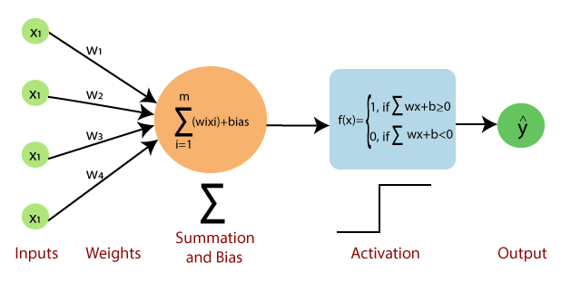

# The Perceptron

Credits: Medium.com, Hjalmar Turesson, ChatGPT

### What is it?

This is the smallest building block of a neural network, it represents a single artificial neuron.

### What do we use it for?

The perceptron is used to develop large neural networks, that have many networks which each contain many perceptrons (or single neurons).

### How does it work?

Below, an image of the basic structure of a perceptron is shown. It consists of multiple inputs each with their own weights, a bias term, an activation function and then an output.



The input to the activation function can be calculated as $x_1 * w_1 + x_2 * w_2 + x_3 * w_3 + x_4 * w_4 + bias$, which is the sum of the inputs multiplied by their weights, added to the bias term. 

The activation function is responsible for introducing non-linearity and mapping the calculated value to the desired output range (usually 0 or 1 for classification). Common activation functions include the step function, sigmoid function, hyperbolic tangent function, and rectified linear unit (ReLU) function. In the future either each of these activation functions or activation functions as a whole may receive their own entry in the data science dictionary.

It is important to note that a single perceptron can not perform any type of non-linear classification (assuming it has a simple activation function and not a non-linear one), as it could only draw a linear decision boundary. It combines the inputs in a linear matter and the activation functions output a binary answer. A classic example of this is the XOR operator, it can not be modelled by a singe perceptron due to its non-linear input to output mapping:

```
Inputs: (0,0), (0,1), (1,0), (1,1)
Outputs: 0, 1, 1, 0 (XOR of the inputs)
```

In this case, the data points (0,0) and (1,1) belong to one class, and (0,1) and (1,0) belong to another. These points cannot be separated by a single straight line, making it impossible for a single-layer perceptron to solve this problem.

We have come up with multiple ways to solve this problem:

* Multi-Layer Perceptron (MLP): By adding one or more hidden layers, an MLP can learn non-linear decision boundaries. Each layer applies a non-linear activation function, allowing the network to capture complex patterns in the data.

* Non-Linear Activation Functions: Using activation functions like the sigmoid, tanh, or ReLU (Rectified Linear Unit) introduces non-linearity into the network, enabling it to model non-linear relationships.

* Kernel Methods in SVM: In the context of Support Vector Machines (SVM), kernel methods can be used to transform data into higher-dimensional spaces where it becomes linearly separable.

Each of these solutions may receive their own entries in the data science dictionary in the future.

One final thing to note is that a multi-layer network with linear activation functions reduces to a single layer and can not perform non-linear classification. Non-linear activation functions are necessary for non-linear classification.